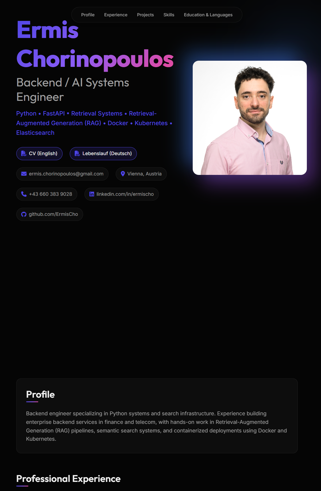

# Ermis Chorinopoulos - CV Website

Personal CV website for **Ermis Chorinopoulos**, a Backend / AI Systems Engineer based in Vienna.

The site presents my professional experience, projects, and technical skills focused on Python backend systems, retrieval-augmented generation (RAG), and search infrastructure.

🔗 **Live Website:** https://ermischo.github.io

## Website Preview

<p align="center">
  
</p>

## Overview

This repository contains the source code for my personal CV website.
It is designed to provide recruiters and collaborators with a quick overview of my experience, projects, and technical background.

The site includes:
- Professional experience
- Backend and AI projects
- Technical skills
- Education and languages
- Downloadable CVs in English and German

## Stack & Technologies

**Frontend**
- Astro
- TypeScript content/data files
- CSS3
- Vanilla JavaScript

**Assets & Tooling**
- Markdown content collections for future case studies and engineering notes
- Python (utility script used to generate favicon assets)
- FontAwesome (icons)

## Development

Install dependencies and start the local Astro server:

```bash
npm install
npm run dev
```

Build the static site for GitHub Pages:

```bash
npm run build
```

Homepage content lives in `src/data/homepage.ts`. Future long-form writing can be added as Markdown files in `src/content/case-studies` or `src/content/notes`.

## Project Structure

```text
.
├── astro.config.mjs
├── package.json
├── src
│   ├── content
│   │   ├── case-studies
│   │   └── notes
│   ├── data
│   │   └── homepage.ts
│   ├── layouts
│   │   ├── BaseLayout.astro
│   │   └── WritingLayout.astro
│   ├── pages
│   │   ├── case-studies
│   │   ├── notes
│   │   └── index.astro
│   └── styles
│       └── global.css
├── assets
│   ├── images
│   │   ├── profile.jpg
│   │   └── website_preview.png
│   └── favicon
│       ├── apple-touch-icon.png
│       ├── apple-touch-icon.svg
│       ├── favicon-16x16.png
│       ├── favicon-32x32.png
│       ├── favicon.ico
│       └── favicon.svg
├── tools
│   └── generate_favicon.py
└── README.md
```
